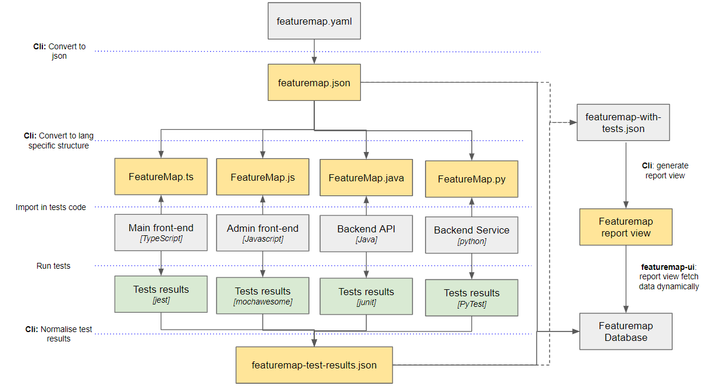

# What is a feature-map?

As it's name implies, the featuremap of a product is a listing of all its available features. It is aimed to be read and understood by anyone with some knowledge of the product. 

The feature-map is aimed to be a centralised view of what a product has to offer. Individual repositories part of the product can then bind their tests to provide more details and context to each feature. 

Rules to follow when writing your feature-map: 
* Name your features as you normally explains them to clients or management, not internal code names
* Stay high-level, feature details such as edit/delete will likely be covered by individual tests

# How it works



# How to install and use

Install the feature-map dependency: 
```
npm install @vaultinum/feature-map
```

Create a `featuremap.yaml` definition file

Create a `featuremap.config.json` file if you need to overwrite teh default settings.

Update your `package.json` file with:
```json
"scripts": {
    "build:featuremap": "featuremap", // Builds the FeaturemapProject.ts file and featuremap.json
    "test": "jest --json --outputFile=./test/jest-results.json",
    "posttest": "npm run build:featuremap" // Optional - usefull to ensure featuremap is always updated with every test run
},
```

# Install schema defintions on VSCode
To allow auto-complete feature and validation you can install the schema defintions to your editor. 

For validation of the `featuremap.yaml` files, edit your `settings.json` file with:
```json
"yaml.schemas": {
    "https://raw.githubusercontent.com/vaultinum/feature-map/main/featuremap.schema.json": [
        "featuremap.yaml"
    ]
}
```

For validation of the `featuremap.config.json` files, edit your `settings.json` file with: 
```json
"json.schemas": [
    {
        "fileMatch": [
            "featuremap.config.json"
        ],
        "url": "https://raw.githubusercontent.com/vaultinum/feature-map/main/featuremap-config.schema.json"
    }
]
```

# Example

This project contains a working example. Check the `package.json` and [test](./test) folder